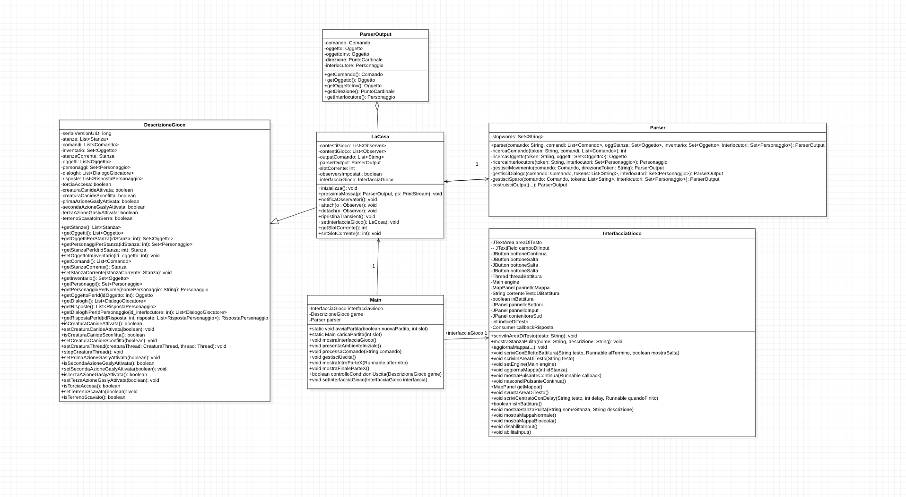
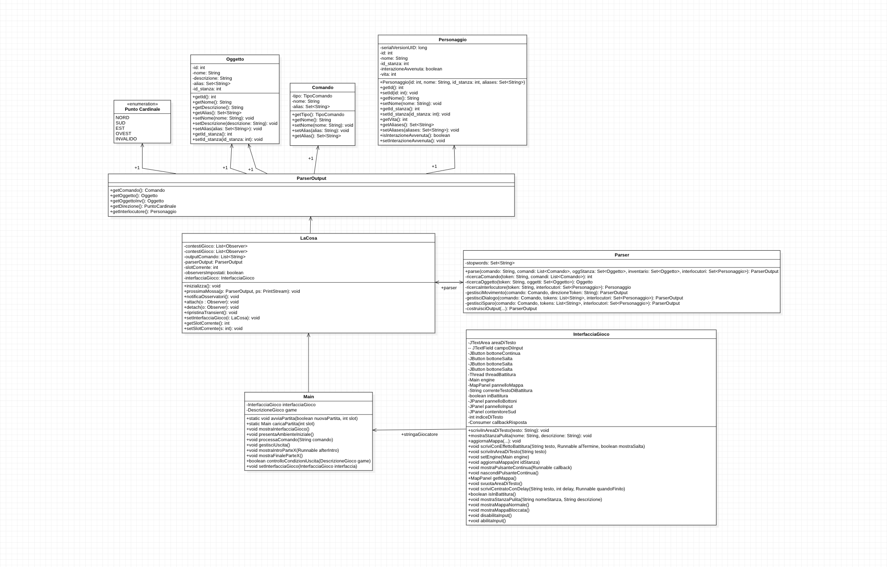
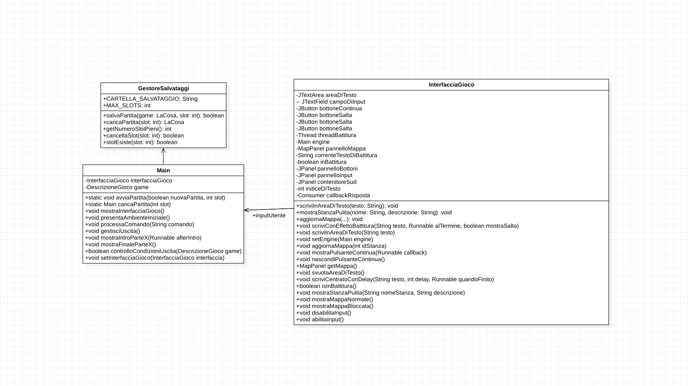

# Relazione Tecnica - La COSA

1. [Introduzione](#Introduzione)
    1. [La Trama](#La-Trama)
2. [Implementazione](#Implementazione)
3. [Diagramma delle Classi](#Diagramma-delle-Classi)
4. [Specifica algebrica](#Specifica-algebrica)
5. [Applicazione argomenti del corso](#Applicazione-argomenti-del-corso)
    1. [Parser](#Parser)
    2. [JDBC Java DataBase Connettivity](#JDBC-Java-DataBase-Connettivity)
    3. [Threads](#Threads)
    4. [I File](#I-File)
    5. [Lambda Expressions](#Lambda-Expressions)
    6. [GUI](#GUI)

## Introduzione
"La COSA: un gioco text-based" è un progetto sviluppato per l'esame del corso di Metodi Avanzati di Programmazione. Il gioco nasce con l'obiettivo di mettere in pratica i principi della Programmazione ad Oggetti attraverso la realizzazione di un'esperienza interattiva ispirata al **capolavoro** di John Carpenter "The Thing".

Questa avventura testuale offre al giocatore la possibilità di esplorare un avamposto antartico abbandonato, affrontando enigmi, combattendo creature ostili e prendendo decisioni cruciali che influenzano l'evoluzione della storia. Il progetto unisce elementi di tensione e mistero, offrendo un gameplay coinvolgente basato su scelte e narrazione dinamica.

**La scrittura, progettazione e sviluppo** di questo gioco testuale sono state **interamente realizzate da Fabio Marchitelli**.

---
### La Trama
Il gioco si svolge in un'ambientazione ispirata al film "**The Thing**", in cui il giocatore assume il ruolo di un sorvegliante innominato dell'Avamposto Antartico numero 3. Una notte, una misteriosa chiamata di soccorso proveniente dall'Avamposto 4 interrompe la routine del protagonista. A contattarlo è un certo dottor Gasly, ma il messaggio è confuso e frammentato, lasciando molte domande senza risposta.

Spinto dal dovere, il giocatore si avventura verso l'Avamposto 4, solo per scoprire che la base è deserta e immersa in un'atmosfera inquietante. L'obiettivo principale sarà esplorare ogni stanza alla ricerca di sopravvissuti, ma ben presto la missione si trasforma in una lotta per la sopravvivenza.

Durante l'esplorazione, il giocatore dovrà affrontare enigmi ambientali, risolvere misteri e difendersi da creature ostili che si nascondono nell'oscurità. Ogni scelta avrà un impatto sullo svolgimento della storia, mettendo alla prova l'istinto del giocatore e la sua capacità di prendere decisioni cruciali in situazioni di pericolo.

Il gioco offre un'esperienza single-player immersiva, in cui tensione e mistero si intrecciano, rendendo ogni partita unica e ricca di suspense.

___
## Implementazione
Il progetto La COSA è stato sviluppato utilizzando il linguaggio di programmazione **Java**, con il supporto di **Maven** per la gestione delle dipendenze e la compilazione del codice. L’architettura del gioco è stata progettata seguendo i principi della programmazione a oggetti, con un'organizzazione modulare per garantire scalabilità e manutenibilità.
Per la gestione dei dati del gioco, è stato integrato un **database H2**.
___
## Diagramma delle Classi
1. Diagramma rappresentante la logica di gioco.


2. Diagramma rappresentante l'implementazione del parser.


3. Diagramma rappresentante l'implementazione del salvataggio.



___
## Specifica algebrica
Nel progetto La COSA, lo sviluppo del gioco ha richiesto l’utilizzo di diverse strutture dati per la gestione efficiente di elementi dinamici come oggetti, comandi, personaggi e osservatori. Tra le strutture maggiormente impiegate troviamo l’**Insieme** (Set), utilizzato in molte componenti del sistema per garantire l’unicità degli elementi e consentire l’accesso rapido senza una particolare priorità o ordinamento. A seguire, la specifica algebrica:

### Specifica Algebrica – Struttura Dati: Insieme

#### Specifica Sintattica

**Tipi coinvolti:**
- `Set`, `Element`, `Boolean`, `Integer`  
  (*dove `Element` rappresenta un tipo generico di dato*)

**Operazioni fondamentali:**
- `createSet() → Set`  
  Crea un nuovo insieme vuoto.

- `isEmpty(set: Set) → Boolean`  
  Verifica se l’insieme non contiene elementi.

- `insert(set: Set, el: Element) → Set`  
  Inserisce un elemento all’interno dell’insieme (se non già presente).

- `delete(set: Set, el: Element) → Set`  
  Rimuove un elemento dall’insieme.

- `includes(set: Set, el: Element) → Boolean`  
  Controlla se un elemento è contenuto nell’insieme.

- `sizeOf(set: Set) → Integer`  
  Restituisce la cardinalità (numero di elementi) dell’insieme.

**Operazioni insiemistiche:**
- `union(a: Set, b: Set) → Set`
- `difference(a: Set, b: Set) → Set`
- `intersection(a: Set, b: Set) → Set`

---

#### Specifica Semantica

**Costruttori:**
- `createSet()`, `insert(set, el)`

**Osservatori:**
- `isEmpty()`, `delete()`, `includes()`, `sizeOf()`

| Operazione                     | Risultato                                                                  |
|-------------------------------|----------------------------------------------------------------------------|
| `isEmpty(createSet())`        | `true`                                                                     |
| `isEmpty(insert(s, e))`       | `false`                                                                    |
| `delete(insert(s, e), x)`     | se `x == e` allora `s`, altrimenti `insert(delete(s, x), e)`              |
| `includes(createSet(), x)`    | `false`                                                                    |
| `includes(insert(s, e), x)`   | se `x == e` allora `true`, altrimenti `includes(s, x)`                     |
| `sizeOf(createSet())`         | `0`                                                                        |
| `sizeOf(insert(s, e))`        | se `includes(s, e)` allora `sizeOf(s)`, altrimenti `sizeOf(s) + 1`        |

---

#### Vincoli e comportamenti anomali

- `delete(createSet(), x)` restituisce errore: non si può rimuovere da un insieme vuoto.
- L’inserimento non modifica l’insieme se l’elemento è già presente (no duplicati).

___
## Applicazione argomenti del corso

### **Parser**

In un gioco testuale come “La Cosa”, il Parser costituisce il **cuore dell’interazione** tra il giocatore e il sistema. Esso rappresenta il modulo interpretativo che legge, comprende e trasforma i comandi testuali dell’utente in istruzioni eseguibili dal motore di gioco. Tuttavia, questo processo non si esaurisce nella sola analisi: il risultato viene strutturato e restituito all'interno dell’oggetto ParserOutput.

Insieme, le classi `Parser` e `ParserOutput` implementano un sistema di parsing robusto e flessibile, capace di gestire un linguaggio naturale semplificato, mantenendo modularità e leggibilità del codice.

#### Parser.java
La classe `Parser` contiene metodi privati per ciascun ambito di analisi (comandi, oggetti, direzioni, personaggi) e un metodo principale parse.
- **Attributo principale**
   * `Set<String> stopwords`: elenco di parole da ignorare durante l’analisi (es. articoli, preposizioni).

##### Costruttore

| **Firma**                       | **Descrizione**                                              |
|---------------------------------|--------------------------------------------------------------|
| `Parser(Set<String> stopwords)` | Costruttore che inizializza l'insieme delle stopwords.   |

##### Metodi

| **Firma**                                                                                                                                                                    | **Descrizione**                                                                                                                                                                                      |
|------------------------------------------------------------------------------------------------------------------------------------------------------------------------------|------------------------------------------------------------------------------------------------------------------------------------------------------------------------------------------------------|
| `ParserOutput parse(String comando, List<Comando> listaComandi, Set<Oggetto> listaOggettiInStanza, Set<Oggetto> inventario, Set<Personaggio> interlocutoriInStanzaCorrente)` | Questo metodo è il punto di ingresso per l’analisi testuale. Riceve la stringa scritta dal giocatore, la spezza in token, rimuove le stopwords, e successivamente invoca uno dei metodi a seguire    |
| `int ricercaComando(String token, List<Comando> comandi)`                                                                                                                    | Questo metodo prende in input i comandi del gioco e li confronta uno ad uno con la prima parola (ovvero token) inserita dall'utente                                                                  |
| `Personaggio ricercaInterlocutore(String token, Set<Personaggio> interlocutori)`                                                                                             | Questo metodo prende in input gli interlocutori presenti nella stanza corrente del giocatore e controlla se la seconda parola inserita dal giocatore rappresenta il nome di uno di questi personaggi |
| `Oggetto ricercaOggetto(String token, Set<Oggetto> oggetti)`                                                                                                                 | Questo metodo viene usato in un duplice modo ovvero sia per essere usato per cercare negli oggeti presenti nella stanza corrente, oppure gli oggetti nell'inventario dell'oggetto                    |
| `boolean controlloTipoComando(int posizioneComandoInLista, TipoComando tipoComando, List<Comando> comandi)`                                                                  |  Verifica se il comando nella posizione specificata è di un certo tipo.                                                                                                                                                                                                    |
| `ParserOutput gestisciMovimento(Comando comando, String direzioneToken)`                                                                                                     | Riconosce le direzioni (es. "nord", "sud", "sinistra", ecc.) e associa l’istruzione a un eventuale movimento all’interno della mappa.                                                                |
| `ParserOutput gestisciDialogo(Comando comando, List<String> tokens,Set<Personaggio> interlocutori)`                                                                          | Riconosce il personaggio con cui si vuole parlare e costruisce l’output per un'interazione di tipo dialogico (es. "parla con mugs").                                                                 |
| `ParserOutput gestisciSparo(Comando comando, List<String> tokens,Set<Personaggio> bersagli)`                                                                                 | Permette di identificare il bersaglio del colpo, nel caso in cui il comando sia SPARA. Analizza i token alla ricerca di un Personaggio riconosciuto nel contesto attuale.                            |
| `ParserOutput costruisciOutput(Comando comando, Oggetto oggettoStanza,Oggetto oggettoInventario, Personaggio interlocutore) `                                                | Metodo centrale che si occupa di combinare i risultati delle analisi specifiche e restituire un oggetto ParserOutput.                                                                                |
___

#### ParserOutput.java
Questa classe rappresenta il risultato dell’analisi del parser: che azione esso ha riconosciuto e su cosa il gioco deve reagire .
- **Attributi principale**
   * `Comando comando`: il comando da eseguire
   * `Oggetto oggetto, invOggetto`: l'oggetto presente nella stanza, o nell'inventario, su cui o con cui agire
   * `PuntoCardinale direzione`: la direzione di moviemento (nord, sud, est, ovest)
   * `Personaggio interlocutore`: il personaggio a cui parlare o, perche no, sparare.

#### Costruttori ParserOutput

| **Firma**                                                                                 | **Descrizione**                                                                                                  |
|--------------------------------------------------------------------------------------------|------------------------------------------------------------------------------------------------------------------|
| `ParserOutput(Comando comando, Oggetto oggetto)`                                           | Inizializza `ParserOutput` con un comando e un oggetto principale coinvolto.                                    |
| `ParserOutput(Comando comando, PuntoCardinale direzione)`                                 | Inizializza `ParserOutput` con un comando di movimento e una direzione (es. "nord").                            |
| `ParserOutput(Comando comando)`                                                            | Inizializza `ParserOutput` con un comando senza oggetti o direzioni (es. "aiuto", "osserva").                   |
| `ParserOutput(Comando comando, Oggetto oggetto, Oggetto oggettoInv)`                      | Inizializza `ParserOutput` con un comando, un oggetto nella stanza e un oggetto proveniente dall'inventario.   |
| `ParserOutput(Comando comando, Personaggio interlocutore)`                                | Inizializza `ParserOutput` con un comando e un personaggio destinatario dell'interazione (es. dialoghi).       |


#### stopwords.txt
Il file `stopwords.txt` contiene un elenco di parole comuni da ignorare durante l'analisi dei comandi dell'utente. Queste parole sono generalmente articoli, preposizioni e altre parole che non influenzano il significato dei comandi del gioco.

___
### JDBC Java DataBase Connettivity

Nel progetto, il database rappresenta **il cuore informativo del mondo di gioco**: tutte le informazioni relative al mondo di gioco, ovvero **stanze, oggetti, personaggi, interazioni dialogiche e "alias testuali"**, sono salvate in modo strutturato tramite un database **H2 embedded**, interrogato tramite **JDBC**.

L’utilizzo di un database relazionale ha permesso di:

- **Centralizzare e normalizzare i dati di gioco**: tutte le informazioni vengono raccolte in un unico sistema coerente, evitando ridondanze e disorganizzazione.
- **Gestire facilmente le relazioni tra entità**: le tabelle sono collegate tra loro (es. stanze collegate, oggetti posizionati in stanze, personaggi associati, dialoghi legati ad NPC).
- **Consentire una facile estensione o modifica dei contenuti narrativi**: è possibile aggiungere nuove stanze, oggetti o dialoghi senza modificare il codice sorgente.
- **Supportare un sistema dialogico ad albero dinamico e scalabile**: i nodi dialogici sono gestiti come entità nel database, rendendo flessibile la costruzione di conversazioni ramificate.

Tutto il sistema di salvataggio, caricamento e interrogazione delle informazioni del mondo di gioco avviene quindi attraverso l'accesso JDBC a un database locale, creando una separazione netta tra **logica narrativa/interattiva** (scritta in Java) e **persistenza dei dati** (gestita tramite SQL e JDBC).

---
#### **Classe `DatabaseManager`**

La classe `DatabaseManager` è il punto centrale per la **connessione e la gestione del database** nel gioco _LaCOSA_.  
Sfrutta **JDBC** per stabilire una connessione con il database H2 in modalità embedded, attraverso un'interfaccia semplice e riutilizzabile.

---

#### Funzionalità principali

- **Connessione al database**

  Il metodo statico `getConnessione()` utilizza `DriverManager.getConnection(...)` per stabilire una connessione al file di database locale.

  ```
  public static Connection getConnessione() throws SQLException {
      return DriverManager.getConnection(JDBC_URL, USER, PASSWORD);
  }
  ```

- **Verifica dell’esistenza del database**

  Il metodo `verificaDatabase(Connection conn)` controlla se esiste la tabella `STANZE`, usata come indicatore per determinare se il database è già stato inizializzato.

  ```
  private static boolean verificaDatabase(Connection conn) throws SQLException {
      DatabaseMetaData dbMetaData = conn.getMetaData();
      try (ResultSet rs = dbMetaData.getTables(null, null, "STANZE", null)) {
          return rs.next();
      }
  }
  ```

- **Inizializzazione automatica al primo avvio**

  Il metodo `main(...)` è pensato per essere eseguito al primo avvio del gioco: se la tabella `STANZE` non esiste, vengono richiamati i seguenti metodi:

    - `CreazioneDatabase.creaTabelle()`
    - `CreazioneDatabase.aggiungiForeignKey()`
    - `InizializzaTabelle.inizializzaTutto()`

  In questo modo, il database viene costruito e popolato automaticamente.

  ```
  public static void main(String[] args) {
      try (Connection conn = DatabaseManager.getConnessione()) {
          if (!verificaDatabase(conn)) {
              CreazioneDatabase.creaTabelle();
              CreazioneDatabase.aggiungiForeignKey();
              InizializzaTabelle.inizializzaTutto();
          } else {
              System.out.println("Il database esiste già.");
          }
      } catch (SQLException e) {
          e.printStackTrace();
      }
  }
  ```

---
#### **Classe `CreazioneDatabase`**

La classe `CreazioneDatabase` è responsabile della **definizione e creazione della struttura fisica** del database del gioco _LaCOSA_.

Questa classe contiene i metodi per creare tutte le tabelle necessarie e per aggiungere vincoli di chiave esterna che non possono essere impostati direttamente durante la creazione iniziale, come nel caso di dipendenze circolari.

---

#### Funzionalità principali

- **Creazione delle tabelle principali**

  Il metodo `creaTabelle()` costruisce le tabelle principali del database:

  - `Stanze`
  - `Oggetti`
  - `Personaggi`
  - `InterazioniGiocatore`
  - `InterazioniPersonaggi`
  - `AliasOggetti`
  - `AliasPersonaggi`

  Le query SQL vengono eseguite in sequenza, definite in un array di stringhe e passate a uno statement JDBC.

  ```
  public static void creaTabelle() {
      String[] creazioneTabelle = {
          "CREATE TABLE Stanze (...);",
          "CREATE TABLE Oggetti (...);",
          "CREATE TABLE Personaggi (...);",
          ...
      };

      try (Connection conn = DatabaseManager.getConnessione();
           Statement stmt = conn.createStatement()) {

          for (String sql : creazioneTabelle) {
              stmt.execute(sql);
          }
          System.out.println("Tabelle create con successo.");

      } catch (SQLException e) {
          e.printStackTrace();
      }
  }
  ```

- **Aggiunta delle chiavi esterne complesse**

  Alcune tabelle, come `InterazioniGiocatore` e `InterazioniPersonaggi`, si riferiscono l’una all’altra.  
  Per gestire queste **dipendenze circolari**, il metodo `aggiungiForeignKey()` aggiunge i vincoli dopo la creazione delle tabelle.

  ```
  public static void aggiungiForeignKey() {
      String[] aggiuntaVincoli = {
          "ALTER TABLE InterazioniGiocatore ADD CONSTRAINT per_dialogo_risposta FOREIGN KEY (id_dialogo_risposta) REFERENCES InterazioniPersonaggi(id);",
          "ALTER TABLE InterazioniPersonaggi ADD CONSTRAINT per_id_risposta FOREIGN KEY (id_dialogo_risposta) REFERENCES InterazioniGiocatore(id);",
      };

      try (Connection conn = DatabaseManager.getConnessione();
           Statement stmt = conn.createStatement()) {

          for (String sql : aggiuntaVincoli) {
              stmt.execute(sql);
          }
          System.out.println("Vincoli delle chiavi esterne aggiunti con successo.");

      } catch (SQLException e) {
          e.printStackTrace();
      }
  }
  ```
---
#### Classe `InizializzaTabelle`

La classe `InizializzaTabelle` si occupa dell’**inizializzazione completa dei dati** nel database, dopo che le tabelle sono state create.  
Non interagisce _direttamente_ con JDBC, ma **raggruppa in maniera centralizzata** tutte le operazioni necessarie al popolamento del mondo di gioco.

---

##### Funzionalità principali

- Richiama in sequenza metodi che inizializzano:

  - Le stanze (`inizializzaStanze()`)
  - Gli oggetti (`inizializzaOggetti()`)
  - I personaggi (`inizializzaPersonaggi()`)
  - Le interazioni tra NPC e giocatore
  - Gli alias per parser testuale
  - I collegamenti tra dialoghi (nodi e risposte)

- Ogni metodo delega l’effettiva scrittura su database a classi come `TabellaStanze`, `TabellaOggetti`, `TabellaPersonaggi`, ecc.

- Il metodo principale `inizializzaTutto()` è invocato da `DatabaseManager` al primo avvio del gioco.

---

##### Il suo Ruolo nel sistema

`InizializzaTabelle` **non si occupa della logica di connessione**, ma funge da **coordinatore della corretta inizializzazione dei contenuti narrativi**: garantisce che, una volta creato lo schema, il database sia popolato con **tutte le entità necessarie** per far partire il gioco in modo coerente.
___

#### **Le Classi `TabellaX`: gestione diretta dei dati con JDBC**

Le classi come `TabellaOggetti`, `TabellaPersonaggi`, `TabellaAliasOggetti`, `TabellaAliasPersonaggi`, `TabellaInterazioniGiocatore`, `TabellaStanze` e `TabellaInterazioniPersonaggi` rappresentano moduli specializzati nella **gestione diretta delle corrispettive tabelle del database di gioco**.

Queste classi:

- Gestiscono **una singola tabella** ciascuna
- Espongono metodi statici per l’**inserimento** dei dati (es. `inserisciOggetto()`, `inserisciAliasOggetto()`, ecc.)
- Utilizzano direttamente **JDBC** tramite `Connection`, `PreparedStatement` e `ResultSet`
- Sono **richiamate principalmente da `InizializzaTabelle`**, che ne coordina l’utilizzo durante la creazione del mondo di gioco
- **Vengono invocate dalla classe `LaCosa`**, nel momento in cui si inizializza una nuova partita, per ricostruire le entità presenti nel database e rendere giocabile lo scenario.

---

#### Esempio: `TabellaAliasOggetti`

La classe `TabellaAliasOggetti` gestisce l’inserimento e la lettura degli alias testuali associati agli oggetti, usati dal parser dei comandi.

```
public static void inserisciAliasOggetto(int id_oggetto, String alias) {
    String comando_sql = "INSERT INTO AliasOggetti (id_oggetto, alias) VALUES (?, ?)";

    try (Connection conn = DatabaseManager.getConnessione();
         PreparedStatement pstmt = conn.prepareStatement(comando_sql)) {

        pstmt.setInt(1, id_oggetto);
        pstmt.setString(2, alias);
        pstmt.executeUpdate();

    } catch (SQLException e) {
        e.printStackTrace();
    }
}
```
___

### Threads

Nel progetto è stato utilizzato il concetto di **multithreading** principalmente per migliorare l'esperienza utente e introdurre dinamiche di gioco asincrone.  
I thread sono stati impiegati in due contesti principali:

---

#### 1. `CreaturaThread`: simulazione di minaccia in background

La classe `CreaturaThread` implementa `Runnable` ed è responsabile della gestione autonoma della **creatura antagonista**.  
Esegue un loop in un thread separato che simula l’avvicinamento progressivo della creatura al giocatore.

#### Funzionalità:

- Mostra messaggi di allerta a intervalli di 10 secondi (`Thread.sleep`)
- Aggiorna dinamicamente l’interfaccia utente con scritte piuttosto ansiogene
- Termina se la creatura viene sconfitta (`sconfiggiCreatura()`)
- All’interruzione, mostra un messaggio narrativo e aggiorna la stanza

L’uso del thread consente di **mantenere attivo il gioco principale**, senza blocchi, pur gestendo eventi ambientali paralleli che aumentano la tensione narrativa.

---

#### 2. Effetto di battitura testuale (`InterfacciaGioco`)

Con l'obiettivo di rendere più "interattivo" e, perche no, **drammatico**, è stato implementato un **effetto battitura**, che stampa i testi lentamente, carattere per carattere.

#### Implementazione:

- Utilizzo di un `Thread` locale nella classe `InterfacciaGioco`
- La battitura avviene in un ciclo `while`, con `Thread.sleep(30)` tra ogni carattere
- Possibilità di interrompere l’effetto tramite il pulsante **"Salta"**
- Al termine, viene eseguito un callback o viene mostrato un pulsante **"Continua"**

Questa tecnica permette una **narrazione più "cinematografica"**, controllata dall’utente, senza bloccare l’input o l’interazione con il resto dell’interfaccia.

---

#### Commenti sull'implementazione dei thread nel progetto

L’utilizzo dei thread nel gioco è stato "richiamato" principalmente da due obiettivi:

1. **Separazione dei compiti asincroni** (creatura e animazioni testuali)
2. **Miglioramento della UX**, evitando interruzioni forzate nel flusso di gioco

I thread sono stati gestiti in modo semplice ma efficace, senza concorrenze complesse o condizioni di race, mantenendo la logica pulita e il comportamento prevedibile.

---

#### Esempio di codice: `CreaturaThread`

```
public void run() {
    try {
        while (!creaturaSconfitta) {
            Thread.sleep(10000);
            interfacciaGioco.scriviInAreaDiTesto("!!QUELLA COSA si sta avvicinando!!");

            Thread.sleep(10000);
            interfacciaGioco.scriviInAreaDiTesto("!!Il ringhio si fa sempre (...)!!");

            Thread.sleep(10000);
            interfacciaGioco.scriviInAreaDiTesto("!!Sta per attaccarti! Usa la pistola!! (...)");
        }
    } catch (InterruptedException e) {
        interfacciaGioco.scriviInAreaDiTesto("La creatura giace a terra, il pericolo è passato.");
        descrizioneGioco.getStanzaCorrente().attivaOsservazioneAggiornata();
    }
}
```

---

#### Esempio di codice: `scriviConEffettoBattitura()`

```
public void scriviConEffettoBattitura(String testo, Runnable alTermine, boolean mostraSalta) {
    correnteTestoDiBattitura = testo;
    indiceDiTesto = 0;
    inBattitura = true;

    if (threadBattitura != null && threadBattitura.isAlive()) {
        threadBattitura.interrupt();
    }

    threadBattitura = new Thread(() -> {
        try {
            while (indiceDiTesto < testo.length()) {
                final char lettera = testo.charAt(indiceDiTesto);

                SwingUtilities.invokeLater(() -> {
                    areaDiTesto.append(String.valueOf(lettera));
                    areaDiTesto.setCaretPosition(areaDiTesto.getDocument().getLength());
                });

                indiceDiTesto++;
                Thread.sleep(30); // Ritardo tra ogni carattere
            }
        } catch (InterruptedException ignored) {
        } finally {
            inBattitura = false;
            SwingUtilities.invokeLater(() -> {
                nascondiSalta();
                if (alTermine != null) {
                    alTermine.run(); // Callback finale
                } else {
                    mostraContinua(); // Mostra pulsante
                }
            });
        }
    });

    threadBattitura.start();

    if (mostraSalta) {
        mostraSalta();
    }
}
```

___

### I File

Nel progetto "LaCOSA" il concetto di file è stato utilizzato principalmente per la **gestione del salvataggio e del caricamento delle partite**.

---

#### Gestione dei salvataggi (`GestoreSalvataggi`)

Il salvataggio dello stato del gioco è stato implementato tramite **serializzazione Java**.  
L'intera istanza di una partita (`LaCosa`), che implementa `Serializable`, viene salvata all'interno di file `.dat` in una cartella dedicata (`saves/`).

Sono disponibili **3 slot di salvataggio numerati** (`slot1.dat`, `slot2.dat`, `slot3.dat`), che il giocatore può sovrascrivere o eliminare.

#### Funzionalità principali:

- **Salvataggio**:
  ```
  ObjectOutputStream oos = new ObjectOutputStream(new FileOutputStream("saves/slot1.dat"));
  oos.writeObject(game); // game è un oggetto di tipo LaCosa
  ```

- **Caricamento**:
  ```
  ObjectInputStream ois = new ObjectInputStream(new FileInputStream("saves/slot1.dat"));
  LaCosa game = (LaCosa) ois.readObject();
  ```

- **Controllo degli slot disponibili**:
  Il metodo `slotEsiste(int slot)` verifica se esiste già un file di salvataggio associato.

- **Eliminazione salvataggio**:
  ```
  File f = new File("saves/slot1.dat");
  f.delete(); // elimina il file di salvataggio
  ```

---

#### "Considerazioni progettuali"

- I file sono gestiti tramite **`java.io`**, con stream adatti alla scrittura e lettura di oggetti (`ObjectOutputStream`, `ObjectInputStream`)
- Tutti i salvataggi vengono isolati nella directory `saves/` per mantenere ordinata la struttura del progetto
- È stato implementato un controllo sugli slot validi (1–3) per evitare errori e accessi fuori range
- Le operazioni I/O sono racchiuse in metodi statici centralizzati nella classe `GestoreSalvataggi`, per facilitare l’integrazione nel resto del gioco

---

#### I Vantaggi di questo approccio:

- Salvataggi persistenti anche dopo la chiusura del gioco  
- Serializzazione automatica di tutto lo stato del mondo di gioco  
- Sistema semplice da estendere (es. slot aggiuntivi, backup, timestamp)

___

### Lambda Expressions

In Java, le lambda sono particolarmente utili quando si vuole passare del comportamento (ad esempio un blocco di codice) come argomento, specialmente in contesti come `Runnable`, `Timer`, `Consumer<String>`, ecc.

Nel progetto esse sono utilizzate in vari punti per rendere il codice più conciso e leggibile, in particolare quando si trattava di passare comportamenti come parametri a metodi.

Le lambda vengono principalmente utilizzate per gestire callback asincroni in combinazione con l'effetto di **battitura animata** nel testo o per **sequenze di eventi**, come quelle dell’introduzione o del finale del gioco.

---

#### Esempi nel progetto

##### **Introduzione e sequenze finali**
All'interno della classe `/Main/`, i metodi `mostraIntroParte*()` e `mostraFinaleParte*()` sfruttano intensamente le lambda per concatenare le azioni:

```
interfacciaGioco.scriviConEffettoBattitura(testo, () -> {
    interfacciaGioco.mostraPulsanteContinua(() -> {
        interfacciaGioco.nascondiPulsanteContinua();
        mostraIntroParte2(afterIntro);
    });
}, true);
```

In questo esempio:

- La prima lambda viene eseguita **quando termina l'effetto battitura**.
- La seconda lambda viene eseguita **quando l'utente clicca "Continua"**.

---

#### **Titolo del gioco centrato con Timer**

Nel metodo `scriviCentratoConDelay()` di `InterfacciaGioco`, si utilizza una lambda all'interno di un `Timer` per gestire l'effetto di scrittura lento del titolo:

```
timer.addActionListener(e -> {
    current.append(testo.charAt(i[0]));
    areaDiTesto.setText(current.toString());
    i[0]++;
});
```

Oppure per il callback finale:

```
new Timer(1500, evt -> {
    ((Timer) evt.getSource()).stop();
    if (quandoFinito != null) {
        quandoFinito.run();
    }
}).start();
```

---
#### Riflessioni Progettuali 

Cio che si è ritrovato è:

- **Codice più compatto:** evita la creazione di classi anonime superflue.
- **Maggiore leggibilità:** specialmente per sequenze temporali, dialoghi e scene.

___

### GUI

Nel progetto *LaCOSA*, l’interfaccia grafica è interamente sviluppata utilizzando **Java Swing**, sfruttando componenti personalizzati e layout flessibili per offrire una **esperienza visiva narrativa, immersiva e interattiva**.

---

#### Classi principali della GUI

##### `InterfacciaGioco`

Questa classe rappresenta la **finestra principale** in cui si svolge il gioco. Gestisce:

- Un'area testuale (`JTextArea`) per visualizzare la narrazione.
- Un campo input (`JTextField`) per i comandi dell’utente.
- Pulsanti “Salta” e “Continua” per controllare l’avanzamento del testo.
- Un pannello dedicato alla **mappa dinamica** del gioco (`MapPanel`).
- Effetti di **battitura animata** per migliorare l’atmosfera.

Gestisce dinamicamente l’interazione tra utente e motore del gioco, e consente la visualizzazione graduale del testo con `Thread` e `Timer`.

##### `InterfacciaIniziale`

È la prima finestra mostrata all’avvio del gioco. Include:

- Un titolo stilizzato.
- Tre pulsanti principali:
  - **Nuova Partita** → chiude la finestra e invoca `Main.avviaPartita(true, -1)`
  - **Carica Partita** → mostra un selettore slot e richiama `Main.avviaPartita(false, slot)`
  - **Esci** → chiude l’applicazione

Utilizza `GridBagLayout` per il posizionamento centralizzato, colori scuri per l’atmosfera, e gestione delle icone personalizzata.

---

#### Effetti visivi e animazioni

#### Battitura del testo (`scriviConEffettoBattitura`)

Un metodo già menzionanto nel capitolo dedicato ai Threads, esso utilizza un `Thread` che simula l’effetto dattilografico carattere per carattere, e consente all’utente di “saltare” l’effetto.

```
threadBattitura = new Thread(() -> {
    try {
        while (indiceDiTesto < testo.length()) {
            final char lettera = testo.charAt(indiceDiTesto);
            SwingUtilities.invokeLater(() -> {
                areaDiTesto.append(String.valueOf(lettera));
                areaDiTesto.setCaretPosition(areaDiTesto.getDocument().getLength());
            });
            indiceDiTesto++;
            Thread.sleep(30);
        }
    } catch (InterruptedException ignored) {}
});
```

Al termine, viene eseguito un `Runnable` opzionale passato come callback (`alTermine`) e vengono gestiti i pulsanti `Continua` / `Salta`.


#### Timer narrativi (`javax.swing.Timer`)

Per introdurre **ritardi temporizzati**, ad esempio per l’apparizione del testo introduttivo o finale. Molti blocchi narrativi nel `/Main` usano Timer per dare ritmo cinematografico alla scena.

---

#### Interazione con la logica del gioco

La GUI comunica con il motore del gioco ( `/Main/` e `LaCosa`) tramite:

- Input dell’utente → parser → gioco
- Output testuale → `InterfacciaGioco.scriviConEffettoBattitura(...)`
- Callback → per concatenare scene (es. introduzione/finali)

L’interfaccia disabilita e abilita l’input a seconda della scena in corso, per garantire una corretta sincronizzazione narrativa.

---

#### Mappa dinamica

Attraverso la classe `MapPanel`, la GUI mostra una **rappresentazione grafica**(molto semplice, ma con l'effetto di creare un effetto retrò) delle stanze. L'interfaccia aggiorna dinamicamente la posizione del giocatore sulla mappa con:

```
interfacciaGioco.getMappa().setStanzaCorrente(idStanza);
```

Il puntino rosso indica la posizione del giocatore nella sua stanza attuale, ed è attivabile/disattivabile in base al contesto (`attivaPuntinoRosso()` / `disattivaPuntinoRosso()`).

---

#### Conclusione

La GUI Swing in *LaCOSA* non è semplicemente un mezzo di input/output, ma un **elemento narrativo attivo**. Le animazioni testuali, l'interfaccia tematica scura, l’integrazione della mappa e i meccanismi asincroni contribuiscono a **rafforzare l’atmosfera thriller/sci-fi** del gioco e rendono l’esperienza utente coinvolgente e cinematografica.

___

